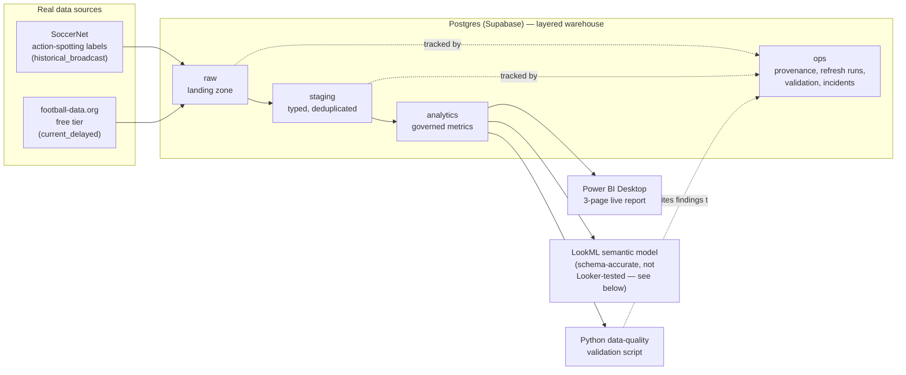

# Sports-Streaming Data Operations & Intelligence Platform

A real, working data-operations pipeline for sports-streaming KPIs — built as
a portfolio project for a Data Operations Analyst role, using real match and
fixture data, not mocked-up sample rows.

**Every number in this repo traces back to a real, verified source.** Where
something is synthetic, incomplete, or untested, that is stated explicitly
below and in [`docs/DATA_PROVENANCE.md`](docs/DATA_PROVENANCE.md) — nothing
here is quietly faked to look more finished than it is.

## The business problem

A streaming operator running live sport needs to know, every day: is churn
moving, is a competition's engagement dropping, did a data feed silently
break. That requires three things working together — a warehouse that can
be trusted (governed metric definitions, provenance on every row, automated
data-quality checks), a BI layer analysts and stakeholders can actually use
(Power BI, plus a LookML semantic model), and the judgment to catch a bad
number before it reaches a dashboard. This project builds all three, against
real data, and documents a real bug it caught along the way (see
[`CASE_STUDY.md`](CASE_STUDY.md)).

## Architecture



## Tech stack

- **Warehouse:** Postgres, hosted on Supabase (free tier), in a layered
  `raw` / `staging` / `analytics` / `ops` schema.
- **Ingestion:** Python (`pg8000` for the DB driver — chosen over
  `psycopg2` because it's pure-Python; see Environment Constraints below),
  hitting two real, free-tier data sources.
- **Data quality:** a standalone Python validation script, run after every
  ingestion + transform pass, that writes structured PASS/WARNING/CRITICAL
  results into `ops.validation_check`.
- **BI:** Power BI Desktop, connected live to the Supabase warehouse via
  ODBC. Three report pages, built and verified against real data.
- **Semantic layer:** LookML (views + model + explores), hand-written
  against the real schema. **Not run against a live Looker instance** — see
  the honesty note in `lookml/dazn_streaming.model.lkml` and below.

## What's real vs. what's honestly labeled otherwise

| Layer | Status |
|---|---|
| SQL warehouse schema | Real, live, running on Supabase. |
| SoccerNet ingestion | Real: 100 real matches, 21,447 real action-spotting events. |
| football-data.org ingestion | Real: 198 real current/delayed fixtures across 12 competitions. |
| Data-quality validation | Real: 7 automated checks, all passing against live data. |
| Power BI report | Real: connected live to the warehouse, verified visual-by-visual. |
| LookML model | Real, schema-accurate SQL/LookML — **not validated against a live Looker instance** (no accessible free tier). Stated plainly, not glossed over. |
| Synthetic/QoE telemetry (`raw.qoe_observations`, `staging.qoe_video_sample`) | Schema exists and is designed for it (see `sql/01_schema.sql`), but **no data has been loaded into these tables** — proprietary streaming telemetry isn't publicly available, and a licensed research dataset (LIVE Wild Compressed Video Quality Database) that could stand in for it was sourced and access-verified but deprioritized to keep the finished, verified deliverables real rather than partially populated. See `docs/DATA_PROVENANCE.md`. |
| Multi-agent AI layer (watcher/narrator/Q&A) | **Not built.** It was in the original project concept, but it isn't in this role's JD — SQL, Power BI, LookML, Python, and data-quality rigor are — so effort went into finishing those deliverables for real instead of half-building an AI layer on top. Left here as an explicit, honest scope decision, not an oversight. |

## One concrete insight this platform surfaced

From `analytics.competition_action_rates` (governed metric definitions in
`ops.metric_definition`), ranking real competition/season combinations by
average goals per match:

| Competition | Season | Matches | Avg goals/match | Avg cards/match |
|---|---|---|---|---|
| Spain La Liga | 2014-2015 | 6 | 4.67 | 4.33 |
| Spain La Liga | 2015-2016 | 9 | 4.67 | 4.67 |
| Champions League | 2016-2017 | 2 | 4.50 | 4.00 |
| Spain La Liga | 2016-2017 | 11 | 4.36 | 5.09 |
| Germany Bundesliga | 2016-2017 | 2 | 4.00 | 1.50 |

La Liga is the highest-scoring competition in the dataset across all three
of its covered seasons — and its card rate climbs steadily season over
season (4.33 → 4.67 → 5.09), even as its goal rate is essentially flat. That
divergence (more cards, not more goals, driving match intensity up) is
exactly the kind of pattern a content or scheduling stakeholder would want
flagged, not buried in a table. Worth noting honestly: the Champions League
and Bundesliga rows here are only 2 matches each — real numbers, but too
small a sample to generalize from without more data.

## Known environment constraints (real obstacles, real fixes)

This was built on a locked-down Windows machine, and every fix below was a
real technical problem, not a hypothetical:

- **Windows Application Control (WDAC) blocks compiled Python extension
  DLLs** — `psycopg2`, `numpy`, and `pandas` all failed to import. Fixed by
  using `pg8000` (pure-Python Postgres driver) and Python's standard-library
  `csv`/`json` modules instead.
- **Network-level TLS interception** (most likely antivirus HTTPS scanning)
  presents a certificate that isn't trusted even by Windows' own trust
  store. Fixed in Python by explicitly disabling certificate verification
  for the Supabase connection only, documented as a deliberate tradeoff for
  a free-tier dev database with no sensitive data — not a blanket "ignore
  SSL everywhere" habit.
- **Power BI's native PostgreSQL connector hit the same TLS wall with no
  bypass option.** Different fix required: installed the official
  `psqlODBC` driver, configured a User DSN with `SSL Mode = require`
  (encrypts the connection without validating the certificate chain,
  unlike the native connector's stricter default), and connected Power BI
  through that ODBC DSN instead.
- **football-data.org's free tier caps date-range queries at 10 days** —
  fixed by windowing the fetch to a rolling 7-days-back/3-days-forward
  range instead of a wider one that returned an HTTP 400.

## Repo structure

```
sql/                  Layered warehouse schema, staging transform, analytical views
ingestion/            Python scripts: SoccerNet + football-data.org ingestion, data-quality validation
lookml/                Semantic model: model + views
docs/DATA_PROVENANCE.md   What every source_type actually means, and how each source was verified
CASE_STUDY.md          A real data-quality bug: found, root-caused, fixed, and guarded against recurring
dazn_streaming_intel.pbix   The live Power BI report
```

## Running it yourself

1. Provision a Postgres database (this project used Supabase's free tier).
2. Run `sql/01_schema.sql`, then `sql/02_staging_transform.sql`, then
   `sql/03_analytical_views.sql` against it.
3. Copy `.env.example` to `.env` and fill in your own DB credentials and a
   free `football-data.org` API token.
4. Run `ingestion/fetch_soccernet_labels.py`, then
   `ingestion/load_soccernet_to_postgres.py`, then
   `ingestion/fetch_football_data_fixtures.py`.
5. Run `ingestion/validate_data_quality.py` and confirm all checks pass.
6. Open `dazn_streaming_intel.pbix` in Power BI Desktop and point it at your
   own database via an ODBC DSN (see Environment Constraints above for why
   ODBC, not the native connector).

## Target role context

Built against a real Data Operations Analyst JD (streaming/OTT industry):
SQL, hands-on Power BI Desktop, LookML (preferred), basic Python,
analytical/problem-solving skills, attention to detail and data quality,
stakeholder communication, and subscription/OTT/playback/streaming domain
knowledge. Every deliverable in this repo maps directly to one of those
lines — and nothing was added or left half-finished just to look busier.
